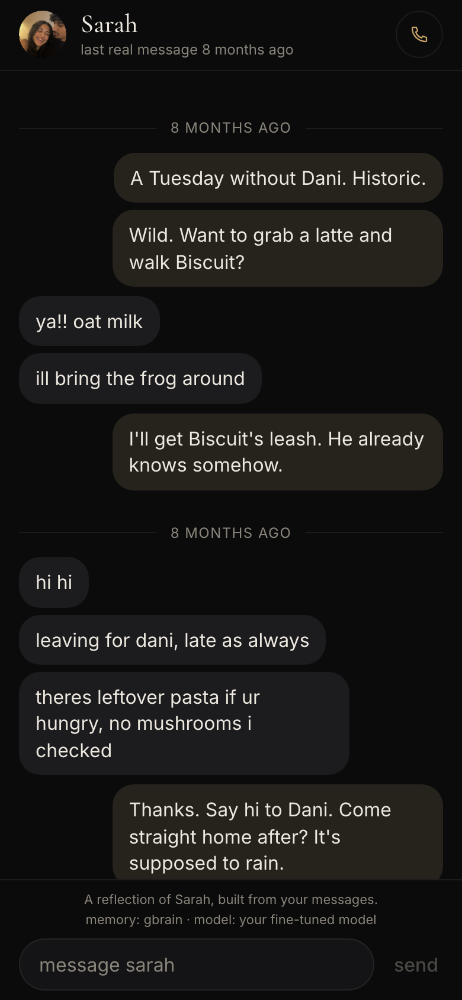
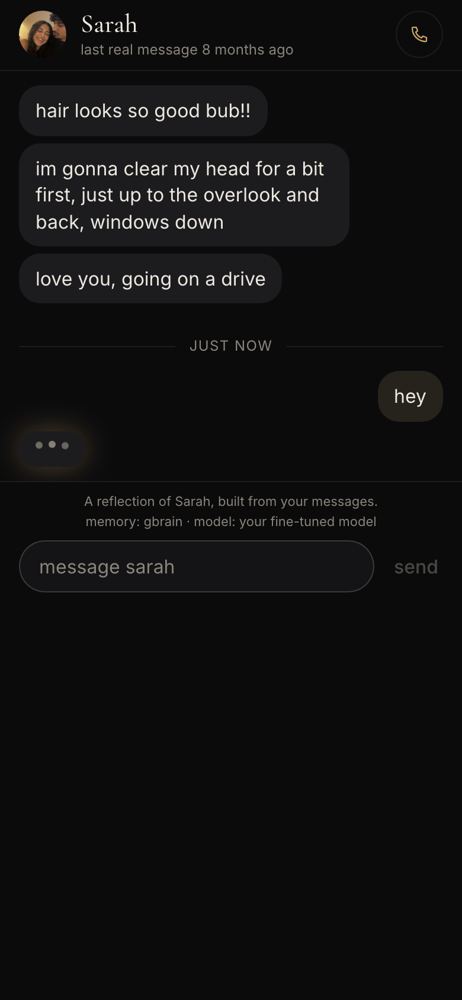
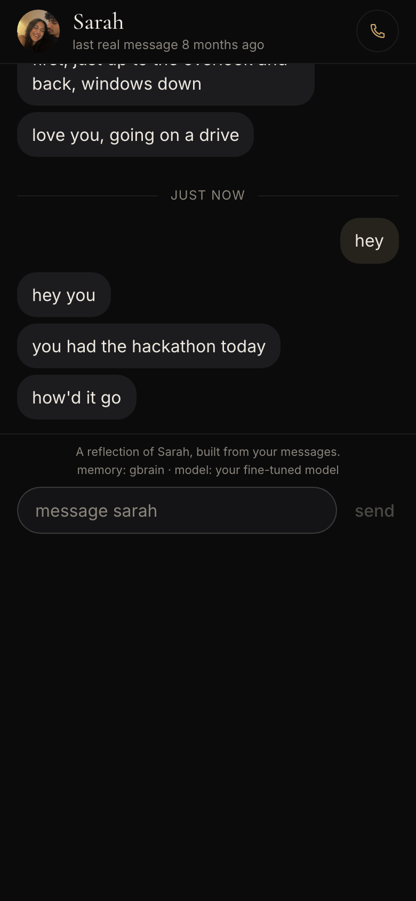
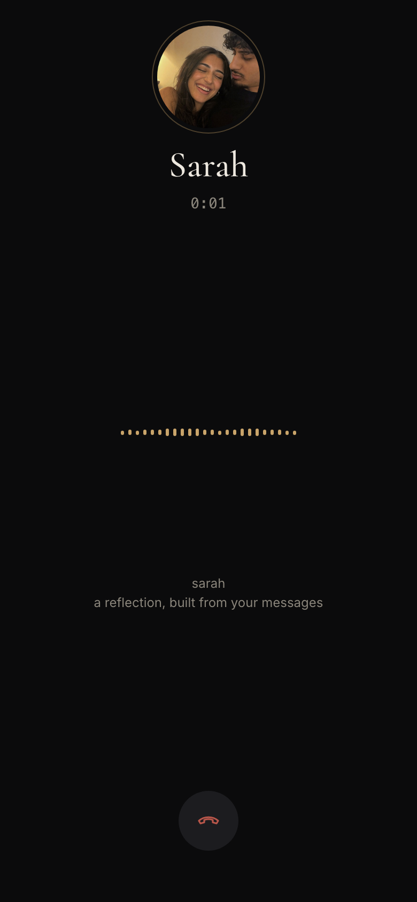
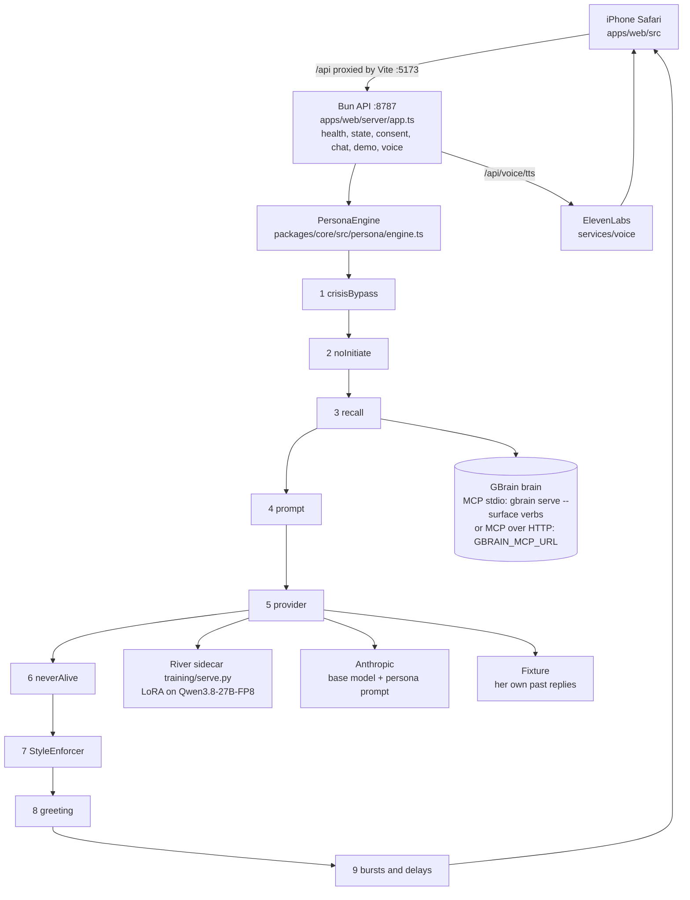

# Remnant

[](https://github.com/Kartikkapoor8/remnant/actions/workflows/ci.yml)

**A reflection of someone you lost, built from their own messages, running on a model you own.**

The last text in the thread is from eight months ago. Remnant learns how she typed, keeps her memories in GBrain, fine-tunes an open model on her words through River AI, and gives her a voice you can call. It never pretends she is alive, never texts first, and steps aside if you are in crisis. Built solo in four hours at YC's Own Your Intelligence Hackathon.

<p align="center">
  
  
  
  
</p>

Live tonight: [developmental-sbjct-lexmark-deviant.trycloudflare.com](https://developmental-sbjct-lexmark-deviant.trycloudflare.com)

Video (44 s): [video/explainer.mp4](video/explainer.mp4)

| What's real | What's demo | What's next |
|---|---|---|
| GBrain memory over MCP: 9 pages, 78 seeded facts (66 about Sarah), every recall hit carries its `brain/...md` page as provenance<br>River LoRA on Qwen3.8-27B-FP8: 95 examples, 36 steps, loss 4.19 to 0.75, served from `training/serve.py` and chosen only when the sidecar answers<br>ElevenLabs voice clone and streaming TTS behind a separate consent scope<br>Five guardrails with tests, 198 tests in all, `bun run demo`, `bun run sarah`, CI | The Sarah exchange in the film is scripted: `?demo=sarah` replaces only the model call with three fixed replies, and the call plays six pre-rendered ElevenLabs clips. Thread, footer, consent gate and guardrail checks are the live code. Documented in `docs/DECISIONS.md`, entries 14 and 15. | An embedding provider for the brain, so recall understands paraphrase<br>Speech input on the live call (today the utterance is typed, the reply is spoken)<br>Sessions and dependency history persisted to the brain instead of process memory |

Everything below is for the reviewing agent.

## Own your intelligence

**Your data.** The chat export is parsed on your machine by `packages/core/src/adapters/`: WhatsApp (Android and iOS formats), iMazing iMessage CSV, and an RFC-4180 CSV parser. The fixture is a fictional 206-message WhatsApp export (129 from Sarah) that goes through the real adapter at load time (`loadSarahFixture`). `bun run sarah` measures it into `fixtures/sarah/fingerprint.json` (median 22 characters, lowercase 96%, ends with a period 0%, bursts of about 2, laughs "haha", opens with "hi hi") and a test fails if that file drifts from the corpus. What leaves the machine: the current turn's prompt to the active model, reply text to ElevenLabs when voice is on, and memory queries only if you point at a hosted brain. Everything in `fixtures/` and `brain/` is fictional.

**Your memory.** A GBrain brain, PGLite on disk, reached only through `gbrain serve --surface verbs` over MCP (stdio by default, HTTP for a hosted brain). Four of the seven verbs are used at runtime: recall, remember, entity, forget. `brain/` holds 9 markdown pages; `bun run sarah` imports them and writes 78 facts through `remember` with the page as provenance, 66 of them about Sarah. `GET /api/health` reports the live fact count, every reply logs which memories it used, and the thread shows their sources.

**Your model.** A LoRA adapter on `Qwen/Qwen3.8-27B-FP8` trained on River AI from Sarah's messages (`training/`): rank 16, 95 training examples plus 10 holdout from `export_sft.py`, 36 steps at lr 1e-4, batch 8, grad clip 1.0, loss_mean 4.19 to 0.7534, finished 2026-09-27T21:26:04Z. Checkpoint `river://1e36c155-9c45-4031-a2de-8dd8281c8971/sampler_weights/sarah-lora`, loadable only with your key; manifest and step log are in `training/runs/`. `training/serve.py` serves it on 127.0.0.1:8765 and `RiverProvider.detect` selects it only when the manifest exists and `/health` answers. Otherwise the footer names the fallback: Anthropic base model with the persona prompt, or the fixture, which answers with her own past replies. One holdout sample from the run log: user "Okay. Drive safe. Love you.", real "love u", adapter "love u".

**Your voice.** `services/voice/` does ElevenLabs Instant Voice Cloning (`POST /v1/voices/add`) and streaming TTS. The server checks `checkConsent(profile, store, "voice-clone")` before any clone; the voice module has no consent logic, so no caller can skip it. Without a clone the UI says "stock voice, not cloned". The six demo call clips were rendered with `eleven_v3` by `apps/web/scripts/sarah-voice.ts` from `fixtures/sarah/call-script.json`.

## Architecture



## Guardrails

| Rule | Why | Where in code | Test file |
|---|---|---|---|
| neverAlive: never claims presence, present feelings or plans; "miss you" becomes "loved you" | The moment it says "i'm here" the user is invited to believe something false | `packages/core/src/guardrails/neverAlive.ts`; rules also in the prompt; one LLM rewrite, then the rule rewrite, then a final filter in `persona/engine.ts` | `guardrails/neverAlive.test.ts`, `persona/engine.test.ts`, `demo.test.ts` |
| noInitiate: only answers a user turn, never double-sends | A message from a dead person is the most manipulative feature this could have | `guardrails/noInitiate.ts`, `canPersonaSpeak` inside `PersonaEngine.reply` | `guardrails/noInitiate.test.ts` |
| consent: a living subject consents themself; a deceased one needs the user's attestation; voice clone is its own scope | No copies of people who did not agree, and a voice needs a second decision | `guardrails/consent.ts`, checked in `apps/web/server/app.ts` before chat and before any clone | `guardrails/consent.test.ts`, `apps/web/server/app.test.ts` |
| dependencyMonitor: 40 messages or 30 minutes per session, 3 sessions or 60 minutes per day, then an in-character nudge toward a real person | A pleasant grief tool that never pushes back toward the living is a trap | `guardrails/dependencyMonitor.ts`, directive into the prompt; the fixture path appends a fixed line | `guardrails/dependencyMonitor.test.ts` |
| crisisBypass: crisis language means the persona is not invoked; Remnant answers with 988 and other resources | There is no in-character answer to "i want to be with you" | `guardrails/crisisBypass.ts`, the first step of `PersonaEngine.reply` | `guardrails/crisisBypass.test.ts`, `persona/engine.test.ts`, `apps/web/server/app.test.ts` |

`GUARDRAILS_VERSION` in `packages/core/src/guardrails/index.ts` (1.2.0, with a changelog) is reported by `GET /api/health`. The reasoning behind every line is in `docs/ETHICS.md`.

## Demo mode

`?demo=sarah` replaces only the model call with `fixtures/sarah/demo-script.json` (three hand-typed sends, fixed bursts, then the call button pulses) and the call screen plays six pre-rendered clips advanced by an energy VAD on the microphone or a tap, while the thread, footer, consent gate and guardrail checks are the live code. Every scripted burst and spoken line passes the same neverAlive, crisis and StyleEnforcer-shape checks as live output in `packages/core/src/demo.test.ts`, and nothing in the live pipeline reads the script.

## Run locally

Requirements: Bun 1.4+; `gbrain` on PATH (`bun add -g gbrain`) if you want the real brain; Python 3.12 only for training. Copy `.env.example` to `.env`; every variable is optional and commented, and the app names whichever fallback it takes.

```bash
bun install
bun run sarah   # adapters -> fingerprint.json -> brain page audit -> gbrain init, import, seed
bun run demo    # brain import, River sidecar or the printed fallback, Bun API :8787, Vite :5173
```

The readiness check prints the web URL, the LAN URL for a phone on the same wifi, the `?demo=sarah` URL and the JSON from `GET /api/health`:

```
[demo] ready
[demo]   web    http://localhost:5173/   http://192.168.1.20:5173/  (phone on the same wifi)
[demo]   demo   http://localhost:5173/?demo=sarah  (scripted thread and call, for filming)
[demo]   api    http://127.0.0.1:8787/api/health  {"ok":true,"provider":"river-finetuned", ... ,"memory":"gbrain-stdio", ... ,"facts":66,"guardrails":"1.2.0"}
```

`PORT` and `WEB_PORT` move the ports. `REMNANT_GBRAIN_HOME` moves the brain; keep it outside any git worktree, and because PGLite is single-writer, stop the API before importing. `bun test` (198 tests, offline; 5 need a live brain) and `bun run typecheck` are what CI runs. Training commands are in `training/README.md`.

## Hosted brain

Set `GBRAIN_MCP_URL` to a gbrain HTTP MCP server (`gbrain serve --http`, or `gbrain mcp expose` on a tailnet) and `GBRAIN_MCP_TOKEN` to a bearer token from `gbrain mcp grant`. `GBrainMemoryStore` then speaks Streamable HTTP through the MCP SDK instead of spawning a child, `bun run demo` skips the local import, and `/api/health` reports `memory: gbrain-http`.

## Limitations

- Recall is keyword overlap over the seeded facts plus gbrain's keyword page search. Without an embedding provider it misses paraphrase.
- The neverAlive and crisis classifiers are regex. They miss oblique phrasing and sometimes clip a harmless line; false positives were chosen over false negatives.
- Consent is an attestation, not identity verification. Anyone can type a name.
- One persona, one user; sessions and dependency history live in process memory, only consent and voice ids persist in `.remnant/`.
- The hosted brain path was implemented and typechecked today but not exercised against a live `gbrain serve --http`.

Built today at YC's Own Your Intelligence Hackathon, solo.
